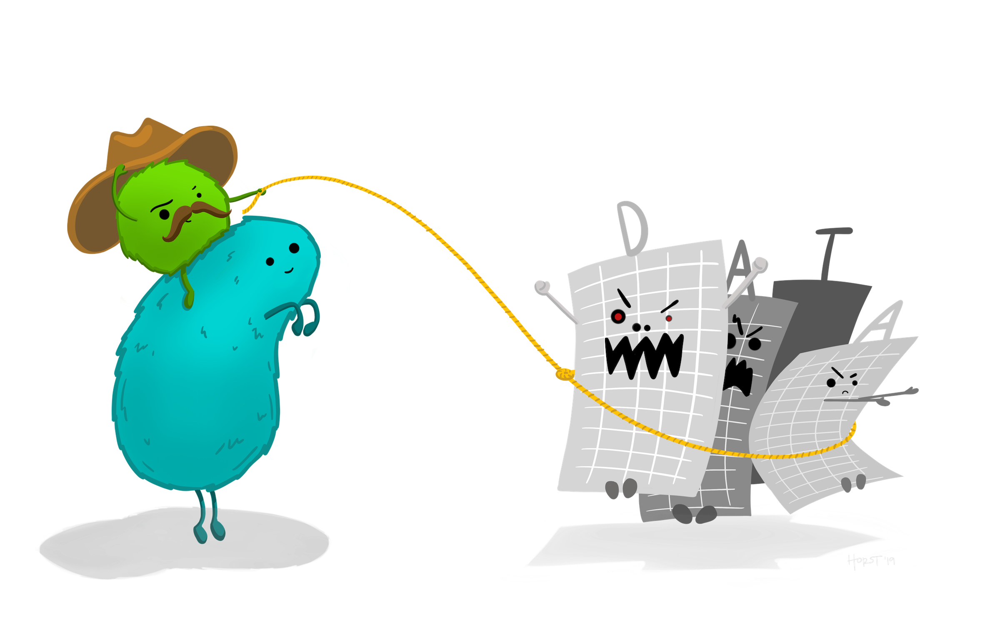
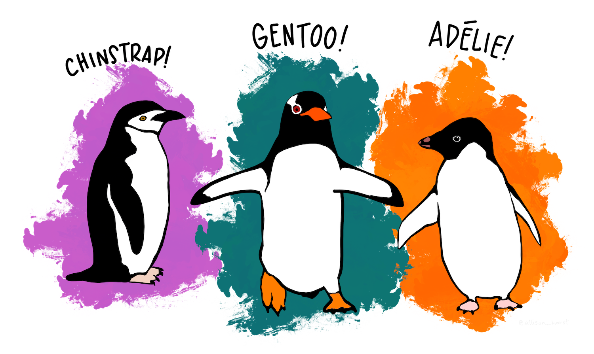
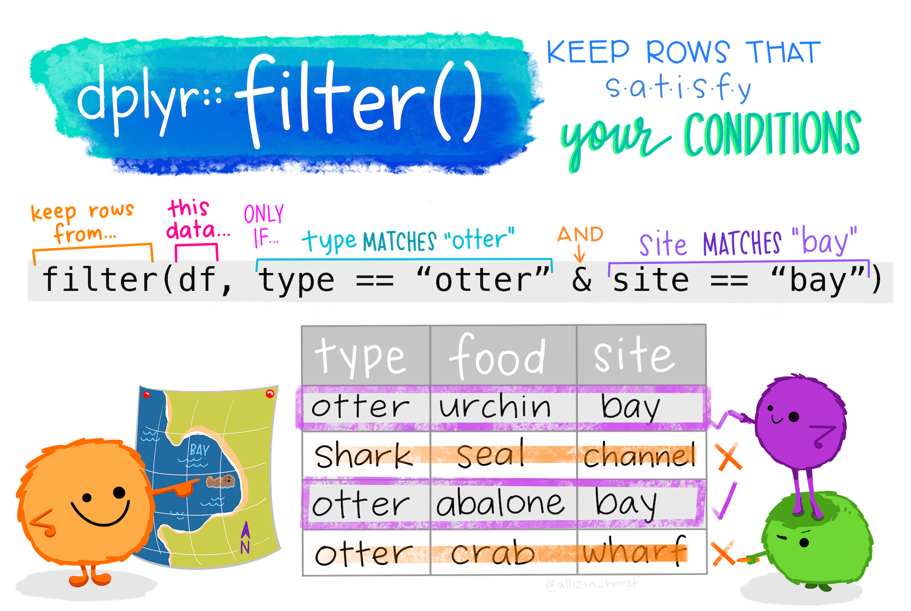
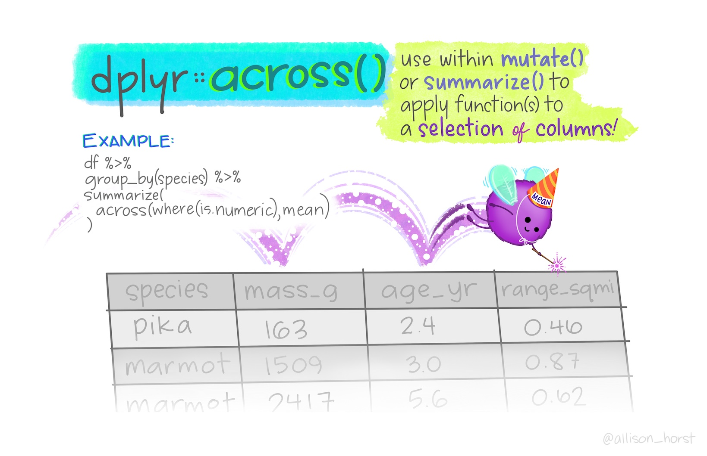

```{r setup, include=FALSE}
library(shiny)
library(learnr)
library(tidyverse)
library(palmerpenguins)
library(kableExtra)
library(fontawesome)
library(here)


knitr::opts_chunk$set(echo = FALSE)
```

## 1. Welcome

In this tutorial, we'll learn some basic functions to help you work with data using functions in the `dplyr` package, part of the `tidyverse` in *R*. 

#### What is the tidyverse?

The [tidyverse](https://www.tidyverse.org/) is a collection of packages that contain useful functions for working with and visualizing data (and a bunch of other stuff). You don't need to install the `tidyverse` to write or run code in this tutorial, since it's already attached behind the scenes, but you can install it with `install.packages("tidyverse")` to work with it on your own outside of this tutorial.

#### What is dplyr?

```{r, echo=FALSE, out.width="30%", fig.align = "left"}

 

```

`dplyr` is one package in the tidyverse. It is the home to many functions that make it easier for us to work with data. Those include things like selecting specific columns, deciding which rows to keep based on whether or not they match our conditions, and finding summary statistics for different variables and groups. Sometimes we call these steps part of "data wrangling." 

```{r, echo=FALSE, out.width="100%", fig.align = "center", fig.cap = "Illustration from Hadley Wickham's 2019 talk, The Joy of Functional Programming"}

 

```

#### What's in this tutorial? 

In this tutorial, you'll learn and practice examples using some functions in `dplyr` to work with data. Those are: 

- `filter()`: keep rows that satisfy your conditions
- `select()`: keep or exclude some columns
- `rename()`: rename columns
- `relocate()`: move columns around
- `mutate()`: add a new column
- `group_by()` + `summarize()`: get summary statistics by group
- `across()`: apply a function across columns
- `count()`: quickly find counts for different groups
- `case_when()`: like friendly if-else

#### What's not in this tutorial? 

A WHOLE LOT. Visit https://dplyr.tidyverse.org/ and [R for Data Science](https://r4ds.had.co.nz/) for more information and examples. 

#### Code chunks for activities

In each section of this tutorial, there will be examples and practice activities. You will complete practice activities in code chunks, like the one below. Once you enter your activity code, press 'Run' to see the output. If you get stuck, press the 'Hint' or 'Solution' button.

```{r calculator, exercise = TRUE}
0.2 + 0.3
```

```{r calculator-hint}
0.2 + 0.4 # Should be plus 0.4
```

```{r calculator-solution}
(0.2 + 0.4)*100 # Multiply by 100 to make a percentage
```

When you press 'Run', the **output** of the code is returned below the code chunk.

Go ahead and try typing in some basic calculations in the area below, and notice that when you update the numbers and press 'Run', the output below it is updated. 

```{r practice_calc, exercise = TRUE}

```

```{r, echo=FALSE, out.width="80%", fig.align = "center"}
  
```

### Thank you to:

#### `dplyr` creators & contributors! 

Hadley Wickham, Romain François, Lionel Henry and Kirill Müller (2020). dplyr: A Grammar of Data Manipulation. R package version 1.0.2. https://CRAN.R-project.org/package=dplyr

#### `tidyverse` creators & contributors! 

Wickham et al., (2019). Welcome to the tidyverse. Journal of Open Source Software, 4(43), 1686, https://doi.org/10.21105/joss.01686

#### `palmerpenguins` package coauthors 

Thanks palmerpenguins team, Dr. Alison Hill & Dr. Kristen B. Gorman!

Horst AM, Hill AP, Gorman KB (2020). palmerpenguins: Palmer Archipelago (Antarctica) penguin data. R package version 0.1.0. https://allisonhorst.github.io/palmerpenguins/

**Valuable feedback and suggestions from:** 

- Gordon Blasco (NCEAS)
- Casey O'Hara (Bren School)

<body>
    <a class="button" href="https://github.com/allisonhorst/dplyr-learnr">Fork GitHub repo
    </a>

## 2. Meet the data

We'll practice some wrangling in `dplyr` using data for penguin sizes recorded by Dr. Kristen Gorman and colleagues with the [Palmer Station Long Term Ecological Research site (Palmer LTER)](https://pal.lternet.edu/) at several islands in the Palmer Archipelago, Antarctica. Data are originally published in: Gorman KB, Williams TD, Fraser WR (2014) PLoS ONE 9(3): e90081. doi:10.1371/journal.pone.0090081, and made available through the Environmental Data Initiative (see data citation details [here](https://allisonhorst.github.io/palmerpenguins/index.html)).

You do **not** need to import the data to work through this tutorial - the data are already here waiting behind the scenes. If you *do* ever want to use the `penguins` dataset outside of this tutorial, you can install the `palmerpenguins` package from CRAN using `install.packages("palmerpenguins")` and learn more about the package [here](https://allisonhorst.github.io/palmerpenguins/).

#### A bit about the penguins:

The 3 species of penguins in this data set are Adelie, chinstrap and gentoo. They are all awesome and adorable.

```{r, echo=FALSE, out.width="100%", fig.align = "center"}

```

There are 8 variables included:

- **species:** a factor denoting the penguin species (Adelie, Chinstrap, or Gentoo)
- **island:** a factor denoting the island (in Palmer Archipelago, Antarctica) where observed
- **bill_length_mm:** a number denoting length of the dorsal ridge of penguin bill (millimeters)
- **bill_depth_mm:** a number denoting the depth of the penguin bill (millimeters)
- **flipper_length_mm:** an integer denoting penguin flipper length (millimeters)
- **body_mass_g:** an integer denoting penguin body mass (grams)
- **sex:** a factor denoting penguin sex (male, female)
- **year:** an integer denoting the study year (2007, 2008, or 2009)

#### What do the data look like?

Below is a glimpse of the first 10 lines of the penguins data (`NA`s indicate missing values throughout). Notice that the data are already in *tidy format* - meaning that:

- Each variable is a column
- Each observation is a row
- Each value is in its own cell

```{r, echo = FALSE}
penguins %>%
  head(10) %>%
  kable() %>%
  kable_styling(full_width = FALSE)
```

OK, go forth and `filter()`!

## 3. dplyr::filter()

[CLICK HERE](https://dplyr.tidyverse.org/reference/filter.html) for `filter()` documentation from tidyverse.org.

Use `filter()` to create a subset of the data only containing rows that satisfy your conditions.

In the image below, the data must satisfy two conditions for a row (observation) to be retained: *type* must match "otter", and *site* must match "bay". Only two of the rows satisfy those conditions (the ones outlined in purple), so only those two would be retained upon running the code.

```{r, echo=FALSE, out.width="80%", fig.align = "center"}

```

As a reminder for the following examples, here's a sample from the **penguins** data (5 observations / 344 total).

```{r}
penguins[c(3,31,199,220,304),] %>%
  kable() %>%
  kable_styling(full_width = F)
```
Now let's learn some different ways we can use `filter()` to help us keep or exclude rows based on our conditions.

### FILTER EXAMPLES

#### `r fa("fas fa-robot", fill = "purple")` Example 1

Make a subset with only chinstrap penguins.

In the code below, we **filter** the **penguins** data to only keep rows where the entry for **species** exactly matches "Chinstrap" (case sensitive). Note that when our condition is based on a string, the string is in quotation marks (here, "Chinstrap").

```{r, echo = TRUE, message = FALSE, warning = FALSE}
dplyr::filter(penguins, species == "Chinstrap")
```

#### `r fa("fas fa-robot", fill = "purple")` Example 2

From `penguins`, filter to only include chinstrap and gentoo penguins.

First, we need to be careful about the type of statement we're going to write. If we want to create a subset that contains chinstraps **and** gentoos, that means we want to keep rows where species matches "Chinstrap" **OR** "Gentoo". We can do this a couple different ways:

- Use the "or" operator, `|` (the vertical line), between conditions
- Use the `%in%` operator, followed by a vector of values to look for a match in

```{r, echo = TRUE, message = FALSE, warning = FALSE, eval = FALSE}
# First way: using the or | operator
dplyr::filter(penguins, species == "Chinstrap" | species == "Gentoo")
```

Does the same thing as...

```{r, echo = TRUE, message = FALSE, warning = FALSE}
# Second way: using the %in% operator
dplyr::filter(penguins, species %in% c("Chinstrap", "Gentoo"))
```

Note that the output is identical for both methods above. It may seem like the first way is easier right now - but if you have a lot of potential matches you're looking for, the second way reduces redundancy and increases code readability.

**WARNING:** The condition `letter == c("A", "B")` is **very different** from `letter %in% c("A", "B")` - you will probably not EVER want to do the first, because it will work its way through the rows of the `letter` column looking for the strings "A" then "B" **in that order**. In other words, it will look for "A" in Row 1, then for "B" in Row 2, then "A" in Row 3, then "B" in Row 4, etc. - when what you probably want to do is just ask "Look in each row and keep it if it's "A" or "B"", which is what the second option (`letter %in% c("A", "B")`) will do.

#### `r fa("fas fa-robot", fill = "purple")` Example 3

Introducing the pipe operator (`%>%`)!

In the examples above, we specified the dataset within the `filter()` function. That's fine for now, but moving forward we'll want to use the pipe operator (`%>%`) to perform operations in logical sequence. You can think of the pipe operator as saying "and then" in your code. For example:

Collect kindling AND THEN open the flue AND THEN start fire using the pipe looks like:

```
Collect kindling %>%
        open the flue %>%
        start fire
```

Let's say we want to use the pipe operator in the example above to filter for chinstraps. We start by telling R the data frame name, AND THEN what to do with it: data `%>%` thing, like this:

```{r, echo = TRUE, message = FALSE, warning = FALSE}
penguins %>%
  dplyr::filter(species == "Chinstrap")
```

Moving forward in this tutorial, we'll use the pipe operator.

#### `r fa("fas fa-robot", fill = "purple")` Example 4

From `penguins`, make a subset with Adelie penguins on Dream Island.

Think carefully above the conditions. In this case, we only want to keep observations (rows) where the species is "Adelie" **AND** the island is "Dream" - a row should only be retained if both of those conditions are met. There are a number of ways you can write an **and** statement within `filter()`, including:

- A comma between conditions indicates both must be met (`filter(x == "a", y == "b")`)
- An ampersand between conditions indicates both must be met (`filter(x == "a" & y == "b")`)

We can create a subset starting from penguins that only contains observations for Adelie penguins on Dream Island as follows:

```{r, echo = TRUE, message = FALSE, warning = FALSE}
penguins %>%
  filter(species == "Adelie", island == "Dream")
```

### Keep or exclude rows based on values

We can also use `dplyr::filter()` to keep or exclude rows based on variable values using standard logical operators (`==`, `<=`, `>=`, `<`, `>`).

Unlike when setting conditions for strings, values within `filter()` don't need to be within quotation marks.

#### `r fa("fas fa-robot", fill = "purple")` Example 5

From `penguins`, keep penguins with a flipper length greater than 200 mm.

```{r, echo = TRUE, message = FALSE, warning = FALSE}
penguins %>%
  filter(flipper_length_mm > 200)
```

#### `r fa("fas fa-robot", fill = "purple")` Example 6

From `penguins`, keep observations where body mass less than or equal to 2900 g.

```{r, echo = TRUE, message = FALSE, warning = FALSE}
penguins %>%
  filter(body_mass_g <= 2900)
```

#### `r fa("fas fa-robot", fill = "purple")` Example 7

From `penguins`, keep observations for Adelie penguins with a bill length greater than 40 mm.

```{r, echo = TRUE, message = FALSE, warning = FALSE}
penguins %>%
  filter(species == "Adelie", bill_length_mm > 40)
```

### Exclude rows based on conditions

Imagine you have a dataset that contains 10 penguin species, and you want to keep observations for 8 of those species. That would be a long list of species to match - if you were referring to the ones you want to keep.

But we can also use `filter()` by saying what we **don't** want to keep, for example we could just list the two species we want to *exclude* to reduce the typing we have to do.

Use `!=` to indicate "does not match" within the `filter()` function.

#### `r fa("fas fa-robot", fill = "purple")` Example 8

Exclude observations for chinstraps from the `penguins` data. In the code below, the `!=` operator is used within `filter()` to keep observations where the species variable **does not match** "Chinstrap".

```{r, echo = TRUE, message = FALSE, warning = FALSE}
penguins %>%
  filter(species != "Chinstrap")
```

<br>
<br>
<hr class="examples">

### FILTER PRACTICE ACTIVITIES


In the code chunks below, write your own code to practice with the `dplyr::filter()` function. If you get stuck, click on the "Hint" and "Solution" buttons.

#### `r fa("fas fa-keyboard", fill = "purple")` Practice Activity 1

Use `filter()` to create a subset from `penguins` that only contains gentoo penguins with a bill depth greater than or equal to 15.5 millimeters.

```{r test_q1, exercise = TRUE}

```

```{r test_q1-hint, warning = FALSE}
penguins %>%
  filter(species == "", bill_depth_mm > ___)
```

```{r filter_q1-solution}
penguins %>%
  filter(species == "Gentoo", bill_depth_mm > 15.5)
```

#### `r fa("fas fa-keyboard", fill = "purple")` Practice Activity 2

Use `filter()` to create a subset from `penguins` that contains observations for male penguins recorded at Dream and Biscoe Islands.

```{r filter_q2, exercise = TRUE}

```

```{r filter_q2-hint}
penguins %>%
  filter(island %in% c("_____","_____"),
         sex == "_____")
```

```{r filter_q2-solution}
penguins %>%
  filter(island %in% c("Dream","Biscoe"),
         sex == "male")
```

#### `r fa("fas fa-keyboard", fill = "purple")` Practice Activity 3

Use `filter()` to create a subset from `penguins` that contains observations for female Adelie penguins with bill lengths less than 35 mm.

```{r filter_q3, exercise = TRUE}

```

```{r filter_q3-hint}
penguins %>%
  filter(sex == "_____",
         species == "_____",
         bill_length_mm < _____)
```


```{r filter_q3-solution}
penguins %>%
  filter(sex == "female",
         species == "Adelie",
         bill_length_mm < 35)
```

#### `r fa("fas fa-keyboard", fill = "purple")` Practice Activity 4

Create a subset from `penguins` containing observations for female chinstrap penguins on Dream and Torgersen Islands.

```{r filter_q4, exercise = TRUE}

```

```{r filter_q4-hint}
penguins %>%
  filter(sex == "____",
         species == "____") %>%
  filter(island %in% c("____","____"))
```

```{r filter_q4-solution}
penguins %>%
  filter(sex == "female",
         species == "chinstrap") %>%
  filter(island %in% c("Dream","Torgersen"))
```

#### `r fa("fas fa-keyboard", fill = "purple")` Practice Activity 5

Create a subset from `penguins` that contains penguins that are either gentoos **OR** have a body mass greater than 4500 g.

```{r filter_q5, exercise = TRUE}

```

```{r filter_q5-hint}
penguins %>%
  filter(species == "_____" | body_mass_g > _____)
```

```{r filter_q5-solution}
penguins %>%
  filter(species == "Gentoo" | body_mass_g > 4500)
```


## 4. dplyr::select()

[CLICK HERE](https://dplyr.tidyverse.org/reference/select.html) for `select()` documentation from tidyverse.org.

The main job of `dplyr::select()` is to help you pick which **columns** (if your data is in tidy format, those are variables) to keep or exclude.

While making subsets of variables is rarely *necessary* for analyses (and is often unadvised), it can make large data sets with many variables more manageable.

As a reminder, here's a sample from the **penguins** data (5 observations / 344 total).

```{r}
penguins[c(3,31,199,220,304),] %>%
  kable() %>%
  kable_styling(full_width = F)
```

### SELECT EXAMPLES

Within `select()`, list the variables that you want to keep in your new subset, separated by commas. Select a range of sequential variables using a colon `:` between inclusive endpoint variables. For example, to select from columns `giraffe` to `narwhal` the entire range is referenced with `giraffe:narwhal`. Note: you can also use `select()` to reorder columns - the order they are listed within `select()` is the order they'll appear in the new subset.

#### `r fa("fas fa-robot", fill = "purple")` Example 1

Keep columns `year`, `island`, and `species` from the `penguins` data.

```{r, echo = TRUE, warning = FALSE, message = FALSE}
penguins %>%
  select(year, island, species)
```

#### `r fa("fas fa-robot", fill = "purple")` Example 2

Keep columns `species` and `body_mass_g` from the `penguins` data.

```{r, echo = TRUE, warning = FALSE, message = FALSE}
penguins %>%
  select(species, body_mass_g)
```

#### `r fa("fas fa-robot", fill = "purple")` Example 3

From the `penguins` data, keep all columns from `species` to `body_mass_g`.

```{r, echo = TRUE, warning = FALSE, message = FALSE}
penguins %>%
  select(species:body_mass_g)
```

#### `r fa("fas fa-robot", fill = "purple")` Example 4

Keep columns from `species` to `bill_depth_mm` *and* `year` from the penguins data. Note that additional (non-sequential) variables are added after a comma.

```{r, echo = TRUE, warning = FALSE, message = FALSE}
penguins %>%
  select(species:bill_depth_mm, year)
```

### Excluding columns

Use the minus sign (`-`) in front of a variable name to exclude a single variable. For example, if I add `-giraffe` within the `select()` function, the `giraffe` column will be excluded.

To exclude a range of columns, use `!(giraffe:narwhale)`.

To exclude several non-sequential columns, use `!c(giraffe, wolf, shark)`.

#### `r fa("fas fa-robot", fill = "purple")` Example 5

From `penguins`, keep all variables *except* `island`

```{r, echo = TRUE, warning = FALSE, message = FALSE}
penguins %>%
  select(-island)
```

#### `r fa("fas fa-robot", fill = "purple")` Example 6

From `penguins`, keep all variables *except* those from `island` to `bill_depth_mm`

```{r, echo = TRUE, warning = FALSE, message = FALSE}
penguins %>%
  select(!(island:bill_depth_mm))
```

#### `r fa("fas fa-robot", fill = "purple")` Example 7

From `penguins`, keep all variables *except* `species`, `flipper_length_mm`, and `year`

```{r, echo = TRUE, warning = FALSE, message = FALSE}
penguins %>%
  select(!c(species, flipper_length_mm, year))
```

### Some useful helper functions

There are **many** helper functions that add power to `select()` (for example, selecting all variables of a specified class, or selecting all variables that start or end with a certain string pattern). Check out more [here](https://dplyr.tidyverse.org/reference/select.html).

Here, we'll just explore a few: `starts_with()`, `ends_with()`, and `contains()`. These allow you to select any columns that match your conditions for the column name.

#### `r fa("fas fa-robot", fill = "purple")` Example 8

Keep columns with names that start with "bill".

```{r, echo = TRUE, warning = FALSE, message = FALSE}
penguins %>%
  select(starts_with("bill"))
```

#### `r fa("fas fa-robot", fill = "purple")`Example 9

Keep columns with names that end in "mm".

```{r, echo = TRUE, warning = FALSE, message = FALSE}
penguins %>%
  select(ends_with("mm"))
```

#### `r fa("fas fa-robot", fill = "purple")` Example 10

Keep columns with names that contain "length".

```{r, echo = TRUE, warning = FALSE, message = FALSE}
penguins %>%
  select(contains("length"))
```

#### `r fa("fas fa-robot", fill = "purple")` Example 11

Keep columns that contain "length" OR start with "bill".

```{r, echo = TRUE, warning = FALSE, message = FALSE}
penguins %>%
  select(contains("length") | starts_with("bill"))
```

### Examples in sequence

#### `r fa("fas fa-robot", fill = "purple")` Example 12

Make a subset from penguins that only contains observations for gentoo penguins, and then only keep columns for island, sex and body mass.

```{r, echo = TRUE, warning = FALSE, message = FALSE}
penguins %>%
  filter(species == "Gentoo") %>%
  select(island, sex, body_mass_g)
```

#### `r fa("fas fa-robot", fill = "purple")` Example 13

Make a subset from penguins that only contains observations for male penguins with flippers longer than 200 mm, and then only keep columns that end with "mm".

```{r, echo = TRUE, warning = FALSE, message = FALSE}
penguins %>%
  filter(sex == "male", flipper_length_mm > 200) %>%
  select(ends_with("mm"))
```

<br>
<br>
<hr class="examples">

### SELECT PRACTICE ACTIVITIES

In the code chunks below, write your own code to practice with the `dplyr::select()` function. If you get stuck, click on the "Hint" or "Solution" buttons.

#### `r fa("fas fa-keyboard", fill = "purple")` Practice Activity 1

Starting with the `penguins` data, only keep the `body_mass_g` variable.

```{r select_q1, exercise = TRUE}

```

```{r select_q1-solution}
penguins %>%
  select(body_mass_g)
```

#### `r fa("fas fa-keyboard", fill = "purple")` Practice Activity 2

Starting with the `penguins` data, keep columns from `bill_length_mm` to `body_mass_g`, and `year`

```{r select_q2, exercise = TRUE}

```

```{r select_q2-hint}
penguins %>%
  select(______:______, ______)
```

```{r select_q2-solution}
penguins %>%
  select(bill_lenth_mm:body_mass_g, year)
```

#### `r fa("fas fa-keyboard", fill = "purple")` Practice Activity 3

Starting with the `penguins` data, keep all columns except `island`

```{r select_q3, exercise = TRUE}

```

```{r select_q3-solution}
penguins %>%
  select(-island)
```

#### `r fa("fas fa-keyboard", fill = "purple")` Practice Activity 4

From `penguins`, keep all variables *except* `species`, `sex` and `year`.

```{r select_q4, exercise = TRUE}

```

```{r select_q4-hint}
penguins %>%
  select(!c(____, ____, ____))
```

```{r select_q4-solution}
penguins %>%
  select(!c(species, sex, year))
```

#### `r fa("fas fa-keyboard", fill = "purple")` Practice Activity 5

From `penguins`, keep the `species` column and any columns that end with "mm".

```{r select_q5, exercise = TRUE}

```

```{r select_q5-hint}
penguins %>%
  select(______, ends_with("__"))
```

```{r select_q5-solution}
penguins %>%
  select(species, ends_with("mm"))
```

#### `r fa("fas fa-keyboard", fill = "purple")` Practice Activity 6

From `penguins`, keep any columns that contain "bill" OR end with "mm".

```{r select_q6, exercise = TRUE}

```

```{r select_q6-hint}
penguins %>%
  select(contains("___") | ends_with("___"))
```

```{r select_q6-solution}
penguins %>%
  select(contains("bill") | ends_with("mm"))
```

#### `r fa("fas fa-keyboard", fill = "purple")` Practice Activity 7

In a piped sequence, starting from `penguins`:

- Only keep observations for female penguins observed on Dream Island, THEN...
- Keep variables `species`, and any variable starting with "bill"

```{r select_q7, exercise = TRUE}

```

```{r select_q7-hint}
penguins %>%
  filter(sex == "_____", island == "_____") %>%
  select(_____, starts_with("____"))
```

```{r select_q7-solution}
penguins %>%
  filter(sex == "female", island == "Dream") %>%
  select(species, starts_with("bill"))
```


## 5. dplyr::relocate()

[CLICK HERE](https://dplyr.tidyverse.org/reference/relocate.html) for `relocate()` documentation from tidyverse.org.

```{r, echo=FALSE, out.width="100%", fig.align = "center"}
knitr::include_graphics("images/dplyr_relocate.png")
```

Use `relocate()` to move columns around, without messing with rows or groups. Some useful bits:

- Use `.before` or `.after` to move a column to before or after another (by name or class)
- If a single column is within the function (e.g. `relocate(col_A)`), that column is moved to the front

See details and more examples from tidyverse.org [here](https://dplyr.tidyverse.org/reference/relocate.html).

As a reminder, here's a sample from the **penguins** data (5 observations / 344 total).

```{r}
penguins[c(3,31,199,220,304),] %>%
  kable() %>%
  kable_styling(full_width = F)
```

### RELOCATE EXAMPLES

#### `r fa("fas fa-robot", fill = "purple")` Example 1

Move the `year` column to the front of the `penguins` data.

```{r, echo = TRUE, warning = FALSE, message = FALSE}
penguins %>%
  relocate(year)
```

#### `r fa("fas fa-robot", fill = "purple")` Example 2

Starting with `penguins`, move the `flipper_length_mm` column to after the `island` column.

```{r, echo = TRUE, warning = FALSE, message = FALSE}
penguins %>%
  relocate(flipper_length_mm, .after = island)
```

#### `r fa("fas fa-robot", fill = "purple")` Example 3

Starting with `penguins`, move the `bill_lenth_mm` column to before `year`.

```{r, echo = TRUE, warning = FALSE, message = FALSE}
penguins %>%
  relocate(bill_length_mm, .before = year)
```

#### `r fa("fas fa-robot", fill = "purple")` Example 4

Starting with `penguins`, move any numeric variables to after any factor variables.

```{r, echo = TRUE, warning = FALSE, message = FALSE}
penguins %>%
  relocate(where(is.numeric), .after = where(is.factor))
```

<br>
<br>
<hr class="examples">

### RELOCATE PRACTICE ACTIVITIES

In the code chunks below, write your own code to practice with the `dplyr::relocate()` function. If you get stuck, click on the "Hint" or "Solution" buttons.

#### `r fa("fas fa-keyboard", fill = "purple")` Practice Activity 1

Starting with `penguins`, move the `species` variable to before the `sex` variable.

```{r relocate_q1, exercise = TRUE}

```
```{r relocate_q1-solution}
penguins %>%
  relocate(species, .before = sex)
```

#### `r fa("fas fa-keyboard", fill = "purple")` Practice Activity 2

Starting with `penguins`, relocate the `bill_length_mm` variable so that it is the first column.

```{r relocate_q2, exercise = TRUE}

```
```{r relocate_q-solution}
penguins %>%
  relocate(bill_length_mm)
```

#### `r fa("fas fa-keyboard", fill = "purple")` Practice Activity 3

Move any factor variables (hint: `is.factor`) to after any integer variables (`is.integer`).

```{r relocate_q3, exercise = TRUE}

```

```{r relocate_q3-solution}
penguins %>%
  relocate(where(is.factor), .after = where(is.integer))
```


## 6. dplyr::rename()

[CLICK HERE](https://dplyr.tidyverse.org/reference/rename.html) for `rename()` documentation from tidyverse.org.

Use `rename()` to change the name of one or more columns. Generally, it'll look something like this:

  `df %>% rename(new_name = old_name)`

You can also use a function to rename multiple columns using `rename_with()`.

```{r, echo=FALSE, out.width="100%", fig.align = "center"}
knitr::include_graphics("images/rename_sm.jpg")
```

As a reminder, here's a sample from the **penguins** data (5 observations / 344 total).

```{r}
penguins[c(3,31,199,220,304),] %>%
  kable() %>%
  kable_styling(full_width = F)
```

### RENAME EXAMPLES

#### `r fa("fas fa-robot", fill = "purple")` Example 1

Rename the `island` column to `palmer_island`.

```{r, echo = TRUE, warning = FALSE, message = FALSE}
penguins %>%
  rename(palmer_island = island)
```

#### `r fa("fas fa-robot", fill = "purple")` Example 2

Rename the `year` column to `study_yr`, and `body_mass_g` to `mass`.

```{r, echo = TRUE, warning = FALSE, message = FALSE}
penguins %>%
  rename(study_yr = year, mass = body_mass_g)
```

#### `r fa("fas fa-robot", fill = "purple")` Example 3

Convert all column names in `penguins` to upper case with `toupper`.

Note: This is probably not a thing you'd actually want to do in the wild.

```{r, echo = TRUE, warning = FALSE, message = FALSE}
penguins %>%
  rename_with(toupper)
```

#### `r fa("fas fa-robot", fill = "purple")` Example 4.

Convert all column names in `penguins` that end with "mm" to upper case (`toupper`).

```{r, echo = TRUE, warning = FALSE, message = FALSE}
penguins %>%
  rename_with(toupper, ends_with("mm"))
```

<br>
<br>
<hr class="examples">

### RENAME PRACTICE ACTIVITIES

#### `r fa("fas fa-keyboard", fill = "purple")` Practice Activity 1

Starting with `penguins`, rename the `flipper_length_mm` column to `flipper_mm`.

```{r rename_q1, exercise = TRUE}

```

```{r rename_q1-solution}
penguins %>%
  rename(flipper_mm = flipper_length_mm)
```

#### `r fa("fas fa-keyboard", fill = "purple")` Practice Activity 2

Starting with `penguins`, rename the `island` column to `island_name` and the `species` column to `penguin_spp`.

```{r rename_q2, exercise = TRUE}

```

```{r rename_q2-solution}
penguins %>%
  rename(island_name = island,
         penguin_spp = species)
```

#### `r fa("fas fa-keyboard", fill = "purple")` Practice Activity 3

Starting with `penguins`, convert any column names that start with "bill" to upper case.

```{r rename_q3, exercise = TRUE}

```

```{r rename_q3-hint}
penguins %>%
  rename_with(____, starts_with("____"))
```

```{r rename_q3-solution}
penguins %>%
  rename_with(toupper, starts_with("bill"))
```

## 7. dplyr::mutate()

[CLICK HERE](https://dplyr.tidyverse.org/reference/mutate.html) for `mutate()` documentation from tidyverse.org.

Use `mutate()` to add a new column, while keeping the existing columns. The general structure is:

```{r, echo = TRUE, eval = FALSE}
df %>%
  mutate(new_column_name = what_it_contains)
```

For example, if I had a data frame `df` with columns `A` and `B`, I can add a new column `C` that is the sum of `A` and `B` as follows (note: you can also use `sum(A,B)` here instead of `A + B`):

```{r, echo = TRUE, eval = FALSE}
df %>%
  mutate(C = A + B)
```

...as demonstrated by mutant monsters below:

```{r, echo=FALSE, out.width="80%", fig.align = "center"}
knitr::include_graphics("images/dplyr_mutate.png")
```

As a reminder, here's a sample from the **penguins** data (5 observations / 344 total).

```{r}
penguins[c(3,31,199,220,304),] %>%
  kable() %>%
  kable_styling(full_width = F)
```

### MUTATE EXAMPLES

#### `r fa("fas fa-robot", fill = "purple")` Example 1

Add a new column to penguins with body mass (currently in grams) converted to kilograms.

```{r, echo = TRUE, warning = FALSE, message = FALSE}
penguins %>%
  mutate(body_mass_kg = body_mass_g / 1000)
```

#### `r fa("fas fa-robot", fill = "purple")` Example 2

Add a new column to penguins with the ratio of bill length to bill depth.

```{r, echo = TRUE, warning = FALSE, message = FALSE}
penguins %>%
  mutate(bill_ratio = bill_length_mm / bill_depth_mm)
```


#### `r fa("fas fa-robot", fill = "purple")` Example 3

You can also add multiple new columns within a single `mutate()`. 

For example, let's add three new columns to penguins within one `mutate()` function: one column that contains the bill ratio (bill length / bill depth), one that contains the body mass converted to kg, and one that contains the flipper length converted to meters. 

```{r, echo = TRUE, warning = FALSE, message = FALSE}
penguins %>%
  mutate(bill_ratio = bill_length_mm / bill_depth_mm,
         body_mass_kg = body_mass_g / 1000,
         flipper_length_m = flipper_length_mm / 1000)
```

#### `r fa("fas fa-robot", fill = "purple")` Example 4

Add a new column with a sequence of values from 1 to the length of the data frame.

```{r, echo = TRUE, warning = FALSE, message = FALSE}
penguins %>%
  mutate(record_number = seq(1:n()))
```

#### `r fa("fas fa-robot", fill = "purple")` Example 5

Convert the `island` variable to a character using `mutate`.

Note / danger: this is a different (and a bit dangerous) use of `mutate()`. If you give the new column the same name as an existing column, the existing column will be **replaced**. As a general rule, if in doubt ADD A COLUMN (little cost) instead of overwriting a column.

```{r, echo = TRUE, warning = FALSE, message = FALSE}
penguins %>%
  mutate(island = as.character(island))
```

#### `r fa("fas fa-robot", fill = "purple")` Example 6

Use `fct_relevel()` within `mutate()` to reorder the factor levels of `island` to (1) Torgersen, (2) Biscoe, (3) Dream.

Note: See `fct_relevel()` & `fct_reorder()` in the `forcats` package to change the order of factor levels.


```{r, echo = TRUE, warning = FALSE, message = FALSE}
penguins %>%
  mutate(island = fct_relevel(island, "Torgersen", "Biscoe", "Dream"))
```

<br>
<br>
<hr class="examples">

### MUTATE PRACTICE ACTIVITIES

#### `r fa("fas fa-keyboard", fill = "purple")` Practice Activity 1

Add a column to `penguins` that contains a new column `flipper_m`, which is the `flipper_length_mm` (flipper length in millimeters) converted to units of meters.

```{r mutate_q1, exercise = TRUE}

```

```{r mutate_q1-hint}
penguins %>%
  mutate(_____ = _____ / 1000)
```

```{r mutate_q1-solution}
penguins %>%
  mutate(flipper_m = flipper_length_mm / 1000)
```

#### `r fa("fas fa-keyboard", fill = "purple")` Practice Activity 2

The `year` column in `penguins` is currently an integer. Add a new column named `year_fct` that is the year converted to a factor (hint: `as.factor()`).

```{r mutate_q2, exercise = TRUE}

```

```{r mutate_q2-hint}
penguins %>%
  mutate(_____ = as.factor(_____))
```

```{r mutate_q2-solution}
penguins %>%
  mutate(year_fct = as.factor(year))
```

#### `r fa("fas fa-keyboard", fill = "purple")` Practice Activity 3

To `penguins`, add a new column `mass_lb` that contains penguin body mass, currently in grams, converted to pounds (1 gram = 0.0022 lb).


```{r mutate_q3, exercise = TRUE}

```

```{r mutate_q3-solution}
penguins %>%
  mutate(mass_lb = body_mass_g * 0.0022)
```

#### `r fa("fas fa-keyboard", fill = "purple")` Practice Activity 4

Starting with `penguins`, do the following within a single `mutate()` function:

- Convert the `species` variable to a character
- Add a new column (called `flipper_cm` with flipper length in centimeters)
- Convert the `island` column to lowercase

```{r mutate_q4, exercise = TRUE}

```

```{r mutate_q4-hint}
penguins %>%
  mutate(species = as.character(_____),
         flipper_cm = _____ / __,
         island = tolower(_____))
```

```{r mutate_q4-solution}
penguins %>%
  mutate(species = as.character(species),
         flipper_cm = flipper_length_mm / 10,
         island = tolower(island))
```

## 8. dplyr::group_by() %>% summarize()

[CLICK HERE](https://dplyr.tidyverse.org/reference/group_by.html) for `group_by()` documentation, and [here](https://dplyr.tidyverse.org/reference/summarise.html)
 for `summarize()` documentation, from tidyverse.org.

Use the combination of `group_by()` and `summarize()` to find find summary statistics for different groups, and put them in a nice table.

From [dplyr.tidyverse.org](https://dplyr.tidyverse.org/):

- `group_by()` "takes an existing tbl and converts it into a grouped tbl where operations are performed 'by group'"
- `summarize()` "creates a new data frame. It will have one (or more) rows for each combination of grouping variables; if there are no grouping variables, the output will have a single row summarising all observations in the input. It will contain one column for each grouping variable and one column for each of the summary statistics that you have specified"

Basically, specify groups within your data with `group_by()`, then use `summarize()` to calculate something (e.g. the mean or other statistic) for each group, & return it in a nice table. It's a powerhouse combo.

As a reminder for the following examples, here's a sample from the **penguins** data (5 observations / 344 total).

```{r}
penguins[c(3,31,199,220,304),] %>%
  kable() %>%
  kable_styling(full_width = F)
```

### GROUP_BY + SUMMARIZE EXAMPLES

#### `r fa("fas fa-robot", fill = "purple")` Example 1

Use `group_by()` and `summarize()` to prepare a summary table containing the mean of penguin body mass, grouped by penguin species. Note that the `na.rm = TRUE` argument is added to exclude missing values.

```{r, echo = TRUE, warning = FALSE, message = FALSE}
penguins %>%
  group_by(species) %>%
  summarize(mass_mean = mean(body_mass_g, na.rm = TRUE))
```

#### `r fa("fas fa-robot", fill = "purple")` Example 2

Use `group_by()` and `summarize()` to prepare a summary table containing the mean and standard deviation of penguin body mass, grouped by penguin species.

Notice that there are now *two* columns created by `summarize()`, mass_mean and mass_sd.

```{r, echo = TRUE, warning = FALSE, message = FALSE}
penguins %>%
  group_by(species) %>%
  summarize(mass_mean = mean(body_mass_g, na.rm = TRUE),
            mass_sd = sd(body_mass_g, na.rm = TRUE))
```

#### `r fa("fas fa-robot", fill = "purple")` Example 3

Use `group_by()` and `summarize()` to prepare a summary table containing the mean and standard deviation of penguin bill length, grouped by penguin species and sex.

Note that the data are now grouped by `species` and `sex` (within `group_by()`), and two columns are created: `bill_length_mean` and `bill_length_sd`, which will contain the mean and standard deviation of bill length within each group.

```{r, echo = TRUE, warning = FALSE, message = FALSE}
penguins %>%
  group_by(species, sex) %>%
  summarize(bill_length_mean = mean(bill_length_mm, na.rm = TRUE),
            bill_length_sd = sd(bill_length_mm, na.rm = TRUE))
```

#### `r fa("fas fa-robot", fill = "purple")` Example 4

Use `group_by()` and `summarize()` to prepare a summary table containing the maximum and minimum flipper length for male Adelie penguins, grouped by island.

Here, we'll first use `filter()` to only keep rows for male Adelie penguins, then use `group_by()` and `summarize()` to find the minimum and maximum flipper length **by island**, & put them in a nice table.

```{r, echo = TRUE, warning = FALSE, message = FALSE}
penguins %>%
  filter(species == "Adelie", sex == "male") %>%
  group_by(island) %>%
  summarize(flip_max_length = max(flipper_length_mm),
            flip_min_length = min(flipper_length_mm))
```

<br>
<br>
<hr class="examples">

### GROUP_BY %>% SUMMARIZE PRACTICE ACTIVITIES

#### `r fa("fas fa-keyboard", fill = "purple")` Practice Activity 1

Starting with `penguins`, create a summary table containing the maximum and minimum length of flippers (call the columns `flip_max` and `flip_min`) for chinstrap penguins, grouped by island.

```{r group_summarize_q1, exercise = TRUE}

```

```{r group_summarize_q1-hint}
penguins %>%
  filter(species == "_______") %>%
  group_by(_____) %>%
  summarize(flip_max = max(_____),
            flip_min = min(_____))
```

```{r group_summarize_q1-solution}
penguins %>%
  filter(species == "Chinstrap") %>%
  group_by(island) %>%
  summarize(flip_max = max(flipper_length_mm),
            flip_min = min(flipper_length_mm))
```

#### `r fa("fas fa-keyboard", fill = "purple")` Practice Activity 2

Starting with `penguins`, group the data by species and year, then create a summary table containing the mean bill depth (call this `bill_depth_mean`) and mean bill length (call this `bill_length_mean`) for each group.

Don't forget: `na.rm = TRUE`

```{r group_summarize_q2, exercise = TRUE}

```

```{r group_summarize_q2-hint}
penguins %>%
  group_by(_____, _____) %>%
  summarize(
    _________ = mean(______, na.rm = TRUE),
    _________ = mean(______, na.rm = TRUE)
  )
```

```{r group_summarize_q2-solution}
penguins %>%
  group_by(species, year) %>%
  summarize(
    bill_depth_mean = mean(bill_depth_mm, na.rm = TRUE),
    bill_length_mean = mean(bill_length_mm, na.rm = TRUE)
  )
```

#### `r fa("fas fa-keyboard", fill = "purple")` Practice Activity 3

Starting with `penguins`, in a piped sequence:

- Add a new column called `bill_ratio` that is the ratio of bill length to bill depth (hint: `mutate()`)
- Only keep columns `species` and `bill_ratio`
- Group the data by `species`
- Create a summary table containing the mean of the `bill_ratio` variable, by species (name the column in the summary table `bill_ratio_mean`)

```{r group_summarize_q3, exercise = TRUE}

```

```{r group_summarize_q3-hint}
penguins %>%
  mutate(bill_ratio = ______ / ______) %>%
  select(______, ______) %>%
  group_by(______) %>%
  summarize(______ = mean(______, na.rm = TRUE))
```

```{r group_summarize_q3-solution}
penguins %>%
  mutate(bill_ratio = bill_length_mm / bill_depth_mm) %>%
  select(species, bill_ratio) %>%
  group_by(species) %>%
  summarize(bill_ratio_mean = mean(bill_ratio, na.rm = TRUE))
```

## 9. dplyr::across()

[CLICK HERE](https://dplyr.tidyverse.org/reference/across.html) for `across()` documentation from tidyverse.org.

From [tidyverse.org](https://dplyr.tidyverse.org/reference/across.html), `dplyr::across()` "makes it easy to apply the same transformation to multiple columns."

```{r, echo=FALSE, out.width="100%", fig.align = "center"}

```

The `across()` function is especially useful within `summarize()` to efficiently create summary tables with one or more functions applied to multiple variables (columns).

Let's compare two ways of doing the same thing: creating a summary table of mean values for all penguin size measurements ending in "mm" (bill depth, bill length, flipper length), by species.

As a reminder, here's a sample from the **penguins** data (5 observations / 344 total).

```{r}
penguins[c(3,31,199,220,304),] %>%
  kable() %>%
  kable_styling(full_width = F)
```

#### Approach 1: Using `group_by()` %>% `summarize()`

```{r, echo = TRUE, warning = FALSE, message = FALSE, eval = FALSE}
penguins %>%
  group_by(species) %>%
  summarize(bill_length_mean = mean(bill_length_mm, na.rm = TRUE),
            bill_depth_mean = mean(bill_depth_mm, na.rm = TRUE),
            flipper_length_mean = mean(flipper_length_mm, na.rm = TRUE))
```

#### Approach 2: Using `across()` within `summarize()`

```{r, echo = TRUE, warning = FALSE, message = FALSE}
penguins %>%
  group_by(species) %>%
  summarize(across(ends_with("mm"), mean, na.rm = TRUE))
```

The output is the same - but the second way (using `across()`) is much more efficient - and becomes even more useful as the number of columns you want to transform increases!

The `across()` function also happily accepts most helper functions introduced for `select()`, including: `starts_with()`, `ends_with()`, `contains()`, as well as to specify classes (e.g. `is.numeric`, `is.character`, etc.). Follow along with the examples & exercises below to learn more!

### ACROSS EXAMPLES

#### `r fa("fas fa-robot", fill = "purple")` Example 1

Starting with `penguins`, use `across()` within `group_by() %>% summarize()` to make a summary table containing the mean value of all columns from bill depth (bill_depth_mm) to body mass (body_mass_g), grouped by species and year.

```{r, echo = TRUE, warning = FALSE, message = FALSE}
penguins %>%
  group_by(species, island) %>%
  summarize(across(bill_depth_mm:body_mass_g, min, na.rm = TRUE))
```

#### `r fa("fas fa-robot", fill = "purple")` Example 2

Starting with `penguins`, use `across()` within `group_by()` and `summarize()` to make a summary table containing the minimum values for bill length and body mass, grouped by penguin species.

```{r, echo = TRUE, warning = FALSE, message = FALSE}
penguins %>%
  group_by(species) %>%
  summarize(across(c(bill_length_mm, body_mass_g), min, na.rm = TRUE))
```

#### `r fa("fas fa-robot", fill = "purple")` Example 3

Starting with `penguins`, use `across()` within `group_by()` and `summarize()` to make a summary table containing the maximum value within any column starting with "bill", grouped by `year`.

```{r, echo = TRUE, warning = FALSE, message = FALSE}
penguins %>%
  group_by(year) %>%
  summarize(across(starts_with("bill"), max, na.rm = TRUE))
```

Since what is presented in the table is the *maximum* value for bill length and depth, we probably want to update the column names. We could do that manually using `rename()`, or we can add the `.names = ` argument within `across()` as shown in the examples below.

#### `r fa("fas fa-robot", fill = "purple")` Example 4

Repeat the example above, but add an argument that will automatically update the column names containing the maximum bill length and depth to start with "max_" followed by the original column name.

```{r, echo = TRUE, warning = FALSE, message = FALSE}
penguins %>%
  group_by(year) %>%
  summarise(across(starts_with("bill"), max, na.rm = TRUE, .names = "max_{.col}"))
```

#### `r fa("fas fa-robot", fill = "purple")` Example 5

Starting from `penguins`, create a summary table that finds the mean and standard deviation for all variables containing the string "length", grouped by penguin species. Update the column names to start with "avg_" or "sd_", followed by the original column names.

There's quite a bit happening here, so a little breakdown:

- We use `contains("length")` to indicate we'll apply the functions to any columns with the word "length" in the name
- Within `list()` is where the functions to be applied across columns are given, and where their "names" of "avg" and "stdev" are set
- We use `.names = ` to define the final column names in the summary table. Here, the name should start with the function "name" specified above ("avg" or "stdev"), then an underscore, then the original column name (that's what `"{.fn}_{.col}"` will do)

```{r, echo = TRUE, warning = FALSE, message = FALSE}
penguins %>%
  group_by(species) %>%
  summarize(across(contains("length"),
                   list(avg = mean, stdev = sd),
                   na.rm = TRUE,
                   .names = "{.fn}_{.col}"))
```

<br>
<br>
<hr class="examples">

### ACROSS PRACTICE ACTIVITIES

#### `r fa("fas fa-keyboard", fill = "purple")` Practice Activity 1

Starting with `penguins`, group data by island then use `across()` to find the median value of groups for any columns containing the string "mm". The names in the resulting table should be the original column name followed by an underscore, then the word "median" (e.g. colname_median).

```{r across_q1, exercise = TRUE}

```

```{r across_q1-hint}
penguins %>%
  group_by(______) %>%
  summarize(across(contains("______"),
                   median,
                   na.rm = TRUE,
                   .names = "_______")
            )
```

```{r across_q1-solution}
penguins %>%
  group_by(species) %>%
  summarize(across(contains("mm"),
                   median,
                   na.rm = TRUE,
                   .names = "{.col}_median")
            )
```

#### `r fa("fas fa-keyboard", fill = "purple")` Practice Activity 2

Starting with `penguins`, only keep observations for Adelie penguins, then use `across()` to find the maximum value for any numeric variable (hint: `where(is.numeric)`) for each island (i.e. group by island).

```{r across_q2, exercise = TRUE}

```

```{r across_q2-hint}
penguins %>%
  filter(species == "______") %>%
  group_by(______) %>%
  summarize(across(where(_____), _____, na.rm = TRUE))
```

```{r across_q2-solution}
penguins %>%
  filter(species == "Adelie") %>%
  group_by(island) %>%
  summarize(across(where(is.numeric), max, na.rm = TRUE))
```

#### `r fa("fas fa-keyboard", fill = "purple")` Practice Activity 3

Starting from `penguins`, write a piped sequence to:

- Exclude penguins observed on Biscoe Island
- Only keep variables `species` through `body_mass_g`
- Rename the `species` variable to `spp_penguin`
- Group the data by `spp_penguin`
- Find the mean value for any variable containing the string "length", by penguin species, with column names updated to the original column name appended with "_max" at the end

```{r across_q3, exercise = TRUE}

```

```{r across_q3-hint}
penguins %>%
  filter(island != "_____") %>%
  select(_____:_____) %>%
  rename(_____ = _____) %>%
  group_by(_____) %>%
  summarize(across(contains("_____"), mean, na.rm = TRUE, .names = "{.col}_avg"))
```

```{r across_q3-solution}
penguins %>%
  filter(island != "Biscoe") %>%
  select(species:body_mass_g) %>%
  rename(spp_penguin = species) %>%
  group_by(spp_penguin) %>%
  summarize(across(contains("length"), mean, na.rm = TRUE, .names = "{.col}_avg"))
```


## 10. dplyr::count()

[CLICK HERE](https://dplyr.tidyverse.org/reference/count.html) for `count()` documentation from tidyverse.org.

The `dplyr::count()` function wraps a bunch of things into one beautiful friendly line of code to help you find counts of observations by group. To demonstrate what it does, let's find the counts of penguins in the `penguins` dataset by species in two different ways:

1. Using `group_by()` %>% `summarize()` with `n()` to count observations
2. Using `count()` to do the exact same thing

As a reminder, here's a sample from the **penguins** data (5 observations / 344 total).

```{r}
penguins[c(3,31,199,220,304),] %>%
  kable() %>%
  kable_styling(full_width = F)
```

#### Approach 1: `group_by()` %>% `summarize()` w/ `n()`

```{r, echo = TRUE, warning = FALSE, message = FALSE}
penguins %>%
  group_by(species) %>%
  summarize(
    n = n()
  )
```

#### Approach 2: `count()`

```{r, echo = TRUE, warning = FALSE, message = FALSE}
penguins %>%
  count(species)
```

Pretty cool, right? The `dplyr::count()` function does all the work of `group_by()`, `summarize()` **and** `n()` for you!

**Note:** The default assumes that each observation is in its own row (case format). If you have a column containing *counts* (i.e. more that one observation are represented in a single row) use the `wt = ` argument to specify the column containing counts, then the `count()` function will sum them instead to find totals.

### COUNT EXAMPLES

#### `r fa("fas fa-robot", fill = "purple")` Example 1

Starting with the `penguins` dataset, find the counts of penguins by species and year.

```{r, echo = TRUE, warning = FALSE, message = FALSE}
penguins %>%
  count(species, year)
```

#### `r fa("fas fa-robot", fill = "purple")` Example 2

Starting from `penguins`, find the number of observations by island.

```{r, echo = TRUE, warning = FALSE, message = FALSE}
penguins %>%
  count(island)
```

<br>
<br>
<hr class="examples">

### COUNT PRACTICE ACTIVITIES

#### `r fa("fas fa-keyboard", fill = "purple")` Practice Activity 1

Starting with `penguins`, find counts of observation by species, island and year.

```{r count_q1, exercise = TRUE}

```

```{r count_q1-solution}
penguins %>%
  count(species, island, year)
```

#### `r fa("fas fa-keyboard", fill = "purple")` Practice Activity 2

Starting with `penguins`, filter to only keep Adelie and gentoo penguins, then find counts by species and sex.

```{r count_q2, exercise = TRUE}

```

```{r count_q2-hint}
penguins %>%
  filter(species %in% c("_____","_____")) %>%
  count(_____, _____)
```

```{r count_q2-solution}
penguins %>%
  filter(species %in% c("Adelie","Gentoo")) %>%
  count(species, sex)
```

## 11. dplyr::case_when()

[CLICK HERE](https://dplyr.tidyverse.org/reference/case_when.html) for `case_when()` documentation from tidyverse.org.

The `case_when()` function is like a really friendly if-else statement. When used within `mutate()`, it allows you to add a new column containing values dependent on your condition(s).

```{r, echo=FALSE, out.width="80%", fig.align = "center"}
knitr::include_graphics("images/dplyr_case_when_sm.png")
```

### CASE_WHEN EXAMPLES

#### `r fa("fas fa-robot", fill = "purple")` Example 1

To `penguins`, add a new column `size_bin` that contains:

- "large" if body mass is greater than 4500 g
- "medium" if body mass is greater than 3000 g, and less than or equal to 4500 g
- "small" if body mass is less than or equal to 3000 g

```{r, echo = TRUE, warning = FALSE, message = FALSE}
penguins %>%
  mutate(size_bin = case_when(
      body_mass_g > 4500 ~ "large",
      body_mass_g > 3000 & body_mass_g <= 4500 ~ "medium",
      body_mass_g <= 3000 ~ "small"
    )
  )
```

#### `r fa("fas fa-robot", fill = "purple")` Example 2

Starting with `penguins`:

- Limit the columns to `species`, `year`, and `flipper_length_mm`
- Rename the `year` column to `study_year`
- Only keep observations for Adelie penguins
- Add a new column called `flipper_rank` that contains:

  - 1 if `flipper_length_mm` is < 200 mm
  - 2 if `flipper_length_mm` is >= 200 mm
  - 0 if `flipper_length_mm` is anything else (e.g. `NA`)

```{r, echo = TRUE, warning = FALSE, message = FALSE}
penguins %>%
  select(species, year, flipper_length_mm) %>%
  rename(study_year = year) %>%
  filter(species == "Adelie") %>%
  mutate(flipper_rank = case_when(
    flipper_length_mm < 200 ~ 1,
    flipper_length_mm >= 200 ~ 2,
    TRUE ~ 0 # 0 for anything else
  ))
```

<br>
<br>
<hr class="examples">

### CASE_WHEN PRACTICE ACTIVITIES

#### `r fa("fas fa-keyboard", fill = "purple")` Practice Activity 1

Add a new column to `penguins` called `study_year` that contains:

- "Year 1" if the year is 2007
- "Year 2" if the year is 2008
- "Year 3" if the year is 2009

```{r case_when_q1, exercise = TRUE}

```

```{r case_when_q1-hint}
penguins %>%
  mutate(study_year =
           case_when(
             year == 2007 ~ "Year 1",
             year == 2008 ~ "Year 2",
             year == 2009 ~ "Year 3"
           ))
```

#### `r fa("fas fa-keyboard", fill = "purple")` Practice Activity 2

Starting with `penguins`, only keep observations for chinstrap penguins, then only keep the `flipper_length_mm` and `body_mass_g` variables. Add a new column called `fm_ratio` that contains the ratio of flipper length to body mass for each penguin. Next, add another column named `ratio_bin` which contains the word "high" if `fm_ratio` is greater than or equal to 0.05, "low" if the ratio is less than 0.05, and "no record" if anything else (e.g. `NA`).

```{r case_when_q2, exercise = TRUE}

```

```{r case_when_q2-hint}
penguins %>%
  filter(species == "_____") %>%
  select(_____, _____) %>%
  mutate(fm_ratio = _____ / _____) %>%
  mutate(ratio_bin = case_when(
    fm_ratio >= 0.05 ~ "_____",
    fm_ratio < 0.05 ~ "_____",
    TRUE ~ "_____"
  ))
```

```{r case_when_q2-solution}
penguins %>%
  filter(species == "Chinstrap") %>%
  select(flipper_length_mm, body_mass_g) %>%
  mutate(fm_ratio = flipper_length_mm / body_mass_g) %>%
  mutate(ratio_bin = case_when(
    fm_ratio >= 0.05 ~ "high",
    fm_ratio < 0.05 ~ "low",
    TRUE ~ "no record"
  ))
```

## Resources

Want to learn more about `dplyr`, the `tidyverse`, or coding in R generally? Here are some great places to start: 

- [R for Data Science](https://r4ds.had.co.nz/) by Hadley Wickham and Garrett Grolemund
- [dplyr.tidyverse.org](https://dplyr.tidyverse.org/)
