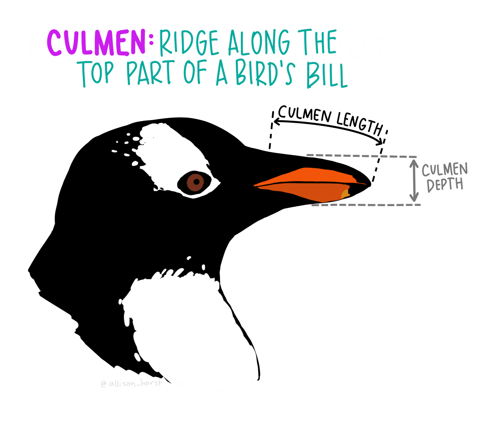

```{r setup, include=FALSE}
library(learnr)
library(tidyverse)
library(palmerpenguins)
library(kableExtra)
knitr::opts_chunk$set(echo = FALSE)
```

## Welcome!


Hello! We're happy to see you here. In this lesson, you'll learn some basic functions to help you work with data using functions in the `dplyr` package, part of the tidyverse in *R*. 

**Whoa whoa whoa.** Part of the **what** in **what**? 

#### R is a programming language

Don't let that intimidate you. *R* is a cool programming language - which means it's a way for you to give your computer directions to do specific things. That can be basic calculations, complex models, or even making graphs and tables! 

For example, you can use *R* like a regular calculator. Press 'Run' in the area below to run the existing code.

```{r calculator, exercise = TRUE}
2 + 3
```

Notice that when you press 'Run', the **output** of the code is returned below it! So by pressing 'Run', you've run your first *R* code! 

Go ahead and try typing in some basic calculations in the area below, and notice that when you update the numbers and press 'Run', the output below it is updated. 

```{r practice_calc, exercise = TRUE}

```

Cool! We see that when we type **code** into those areas (that I'll call 'code chunks' moving forward) and press 'Run', the output is returned just below it. 

Now that you know how to run some *R* code in this tutorial...

#### What is the tidyverse?

The [tidyverse](https://www.tidyverse.org/) is a collection of packages that contain useful *functions* for working with and visualizing data. 

#### What is `dplyr`?

`dplyr` is one *package* in the tidyverse. It is the home to many functions that make it easier for us to work with data. Those include things like selecting specific columns, deciding which rows to keep, and finding summary statistics for different variables and groups. Sometimes we call these steps part of "data wrangling." 

```{r, echo=FALSE, out.width="100%", fig.align = "center"}
knitr::include_graphics("images/data_wrangler.png")  
```

#### What's in this tutorial? 

In this tutorial, you'll learn and practice examples using some functions in `dplyr` to work with data. Those are: 

- `filter()`: keep rows that satisfy your conditions
- `group_by()` + `summarize()`: get summary statistics
- `across()`: apply a function across columns
- `count()`: quickly find counts for different groups
- `mutate()`: add a new column
- `select()`: keep or exclude some columns
- `rename()`: rename columns
- `relocate()`: move columns around


## Meet the data

We'll practice some wrangling in `dplyr` using data for penguin sizes recorded by Dr. Kristen Gorman and others at several islands in the Palmer Archipelago, Antarctica. Data are originally published in: Gorman KB, Williams TD, Fraser WR (2014) PLoS ONE 9(3): e90081. doi:10.1371/journal.pone.0090081

You do **not** need to import the data to work through this tutorial - the data are already here waiting behind the scenes.

But if you *do* ever want to use the penguins data outside of this tutorial, they now exist in the [**palmerpenguins**](https://github.com/allisonhorst/palmerpenguins) package in *R*, which you can install from github using the following: 

```
library(remotes)
remotes::install_github("allisonhorst/palmerpenguins")
```

#### A bit about the penguins: 

The 3 species of penguins in this data set are Adélie, Chinstrap and Gentoo. They are all awesome and adorable. 

```{r, echo=FALSE, out.width="100%", fig.align = "center"}
knitr::include_graphics("images/lter_penguins.png")  
```

There are 7 variables included: 

- **species:** a factor denoting the penguin species (Adelie, Chinstrap, or Gentoo)
- **island:** a factor denoting the island (in Palmer Archipelago, Antarctica) where observed
- **culmen_length_mm:** a number denoting length of the dorsal ridge of penguin bill (millimeters)
- **culmen_depth_mm:** a number denoting the depth of the penguin bill (millimeters)
- **flipper_length_mm:** an integer denoting penguin flipper length (millimeters)
- **body_mass_g:** an integer denoting penguin body mass (grams)
- **sex:** a factor denoting penguin sex (MALE, FEMALE)

Which might make you ask, "What is a penguin culmen?" Here's an illustration of how those were measured by Dr. Gorman: 

```{r, echo=FALSE, out.width="60%", fig.align = "center"}
  
```

#### What do the data look like?  

Below is a glimpse of the first 10 lines of the penguins data (`NA`s indicate missing values throughout):

```{r, echo = FALSE}
penguins %>% 
  head(10) %>% 
  kable() %>% 
  kable_styling(full_width = FALSE)
```
OK, go forth and `filter()`! 

## filter()

Use `filter()` to create a subset of the data only containing rows that satisfy your conditions. 

```{r, echo=FALSE, out.width="80%", fig.align = "center"}
knitr::include_graphics("images/dplyr_filter_sm.png")  
```

In the image above, the data must satisfy two conditions for a row to be retained: *type* must match "otter", and *site* must match "bay". Only two of the rows satisfy those conditions (the ones outlined in purple), so only those two would be retained upon running the code. 

Here's a sample from the **penguins** data (5 observations / 344 total) as a reminder. We can see here that the three penguin species are "Adelie", "Chinstrap" and "Gentoo", and the three islands are "Torgersen", "Biscoe", and "Dream." 

```{r}
penguins[c(3,31,199,220,304),] %>% 
  kable() %>% 
  kable_styling(full_width = F)
```
Now let's use `filter()` to help us keep or exclude rows based on our conditions. 

### Keeping rows that match a string

#### Example 1: Make a subset with only Chinstrap penguins

In the code below, we **filter** the **penguins** data to only keep rows where the entry for **species** exactly matches "Chinstrap". Press "Run" to see the outcome! 

```{r chinstrap, exercise = TRUE}
dplyr::filter(penguins, species == "Chinstrap")
```


## select()

Use `select()` to pick which columns to keep or exclude from your data. 


## rename()

Use `rename()` to change the name of one or more columns. 

## relocate()

```{r, echo=FALSE, out.width="100%", fig.align = "center"}
knitr::include_graphics("images/dplyr_relocate.png")  
```

Use `relocate()` to change the order of your columns. 

## mutate()

```{r, echo=FALSE, out.width="80%", fig.align = "center"}
knitr::include_graphics("images/dplyr_mutate.png")  
```

Use `mutate()` to add a new column, while keeping the existing columns.

## groupby() + summarize() 

Use the combination of `group_by()` and `summarize()` to find find summary statistics for different groups. 

## across()

```{r, echo=FALSE, out.width="100%", fig.align = "center"}
knitr::include_graphics("images/dplyr_across.png")  
```

Use `across()` to calculate 

## count()
